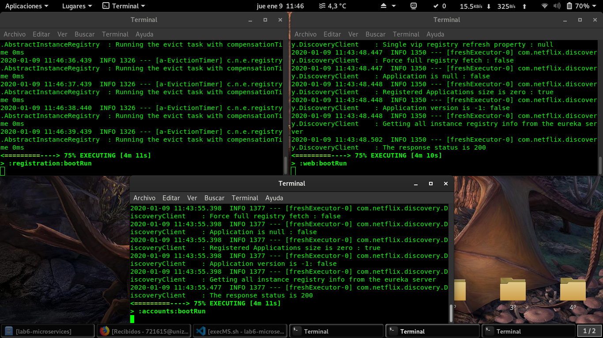
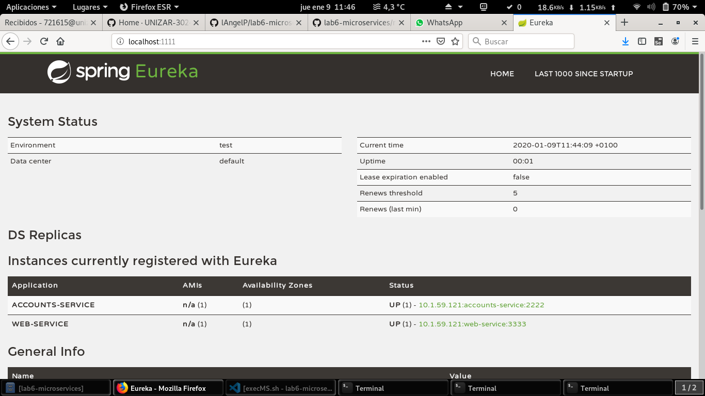
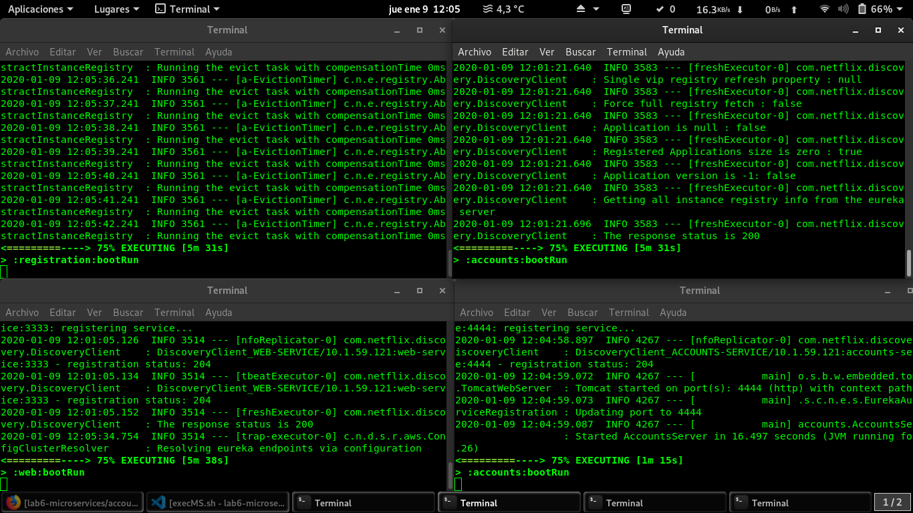
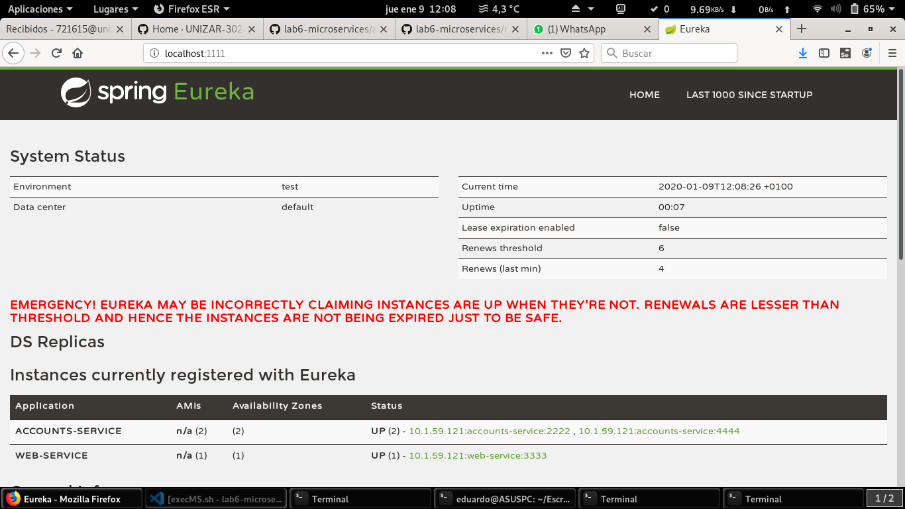
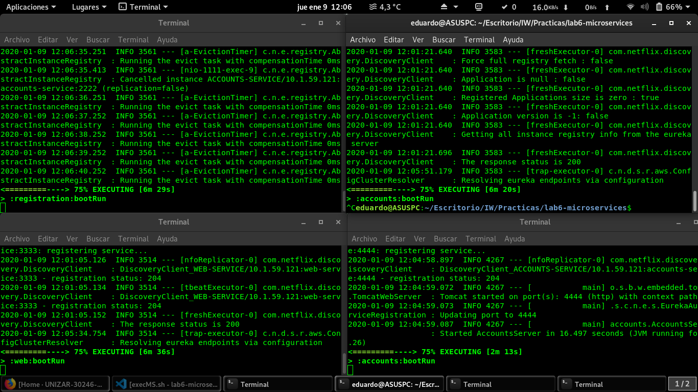
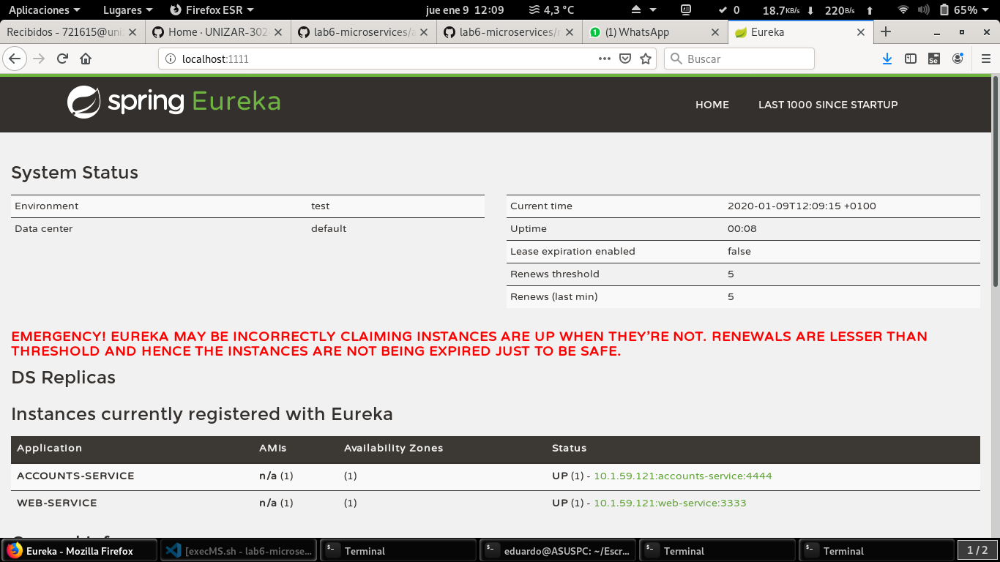

## lab6-microservices report

#### Launch services

The three services are launched with the scripts created in their respective ports.

#### Launch a second account service

A second account service is launched in port 4444, creating a second application.yml for it.

#### Kill the first account service

The first account service is killed and unregistered.